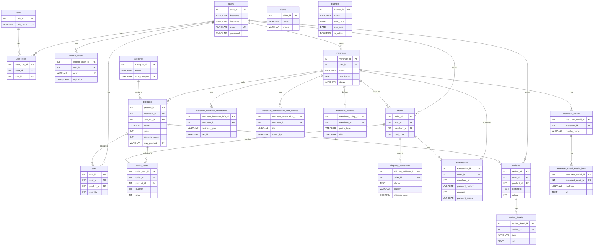

# Proyek E-Commerce gRPC

Proyek ini merupakan **implementasi backend untuk platform e-commerce** yang dirancang untuk mendukung seluruh proses bisnis utama dalam perdagangan digital, mulai dari **pengelolaan pengguna** hingga **transaksi pembayaran**. Sistem ini dibangun dengan pendekatan modular sehingga setiap layanan memiliki tanggung jawab yang spesifik, namun tetap terhubung secara efisien melalui komunikasi antar layanan.

Arsitektur proyek memanfaatkan **gRPC sebagai protokol komunikasi antar layanan**. Dengan gRPC dan Protobuf, pertukaran data antar komponen menjadi lebih cepat, ringan, serta mudah diperluas. Hal ini memungkinkan sistem untuk **skalabel** ketika jumlah pengguna, produk, maupun transaksi meningkat secara signifikan.

Semua data penting — mulai dari detail pengguna, katalog produk, hingga catatan transaksi — disimpan secara konsisten dalam basis data, sehingga platform ini dapat menjadi fondasi yang **andal, aman, dan siap produksi** untuk aplikasi e-commerce modern.

### 🎯 Lingkup & Fitur Utama

* **🔐 Autentikasi & Manajemen Pengguna**
  Mendukung registrasi, login, serta otorisasi berbasis **JWT**. Sistem juga memungkinkan pengaturan role pengguna (misalnya customer, merchant, atau admin).

* **📦 Manajemen Produk & Kategori**
  Admin maupun merchant dapat menambahkan, mengubah, atau menghapus produk. Produk dikategorikan untuk mempermudah pencarian dan pengelolaan stok.

* **🏬 Manajemen Merchant**
  Merchant dapat membuat akun, mengelola toko mereka, serta menambahkan katalog produk yang dimiliki.

* **🛒 Keranjang Belanja (Shopping Cart)**
  Pengguna dapat menambahkan produk ke keranjang, memperbarui jumlah, dan menyimpan daftar item sebelum melakukan pemesanan.

* **📑 Proses Pemesanan (Order)**
  Mendukung alur penuh dari checkout hingga pencatatan pesanan. Setiap order dicatat dengan detail produk, jumlah, harga, status, dan informasi pengiriman.

* **💳 Transaksi & Pembayaran**
  Sistem mencatat pembayaran yang dilakukan oleh pengguna terhadap pesanan mereka. Proses ini dirancang agar **terintegrasi dengan merchant** dan tercatat secara transparan.

* **⭐ Ulasan Produk**
  Setelah pesanan selesai, pengguna dapat memberikan ulasan dan rating terhadap produk yang dibeli, sehingga platform lebih interaktif dan mendukung kepercayaan konsumen.

---

## 🧰 Tech Teknologi

- 🐹 **Go (Golang)** — Bahasa implementasi.
- 🌐 **Echo** — Kerangka kerja web minimalis untuk membangun REST API.
- 🪵 **Zap Logger** — Pencatatan terstruktur untuk aplikasi berkinerja tinggi.
- 📦 **SQLC** — Menghasilkan kode Go yang aman dari tipe dari kueri SQL.
- 🚀 **gRPC** — RPC berkinerja tinggi untuk komunikasi layanan internal.
- 🧳 **Goose** — Alat migrasi untuk mengelola perubahan skema database.
- 🐳 **Docker** — Platform kontainerisasi untuk lingkungan pengembangan yang konsisten.
- 📄 **Swago** — Menghasilkan dokumentasi Swagger 2.0 untuk rute Echo.
- 🔗 **Docker Compose** — Mengelola aplikasi Docker multi-kontainer.

---

## Entity-Relationship Diagram (ERD)

Berikut adalah ERD yang menggambarkan skema database dari proyek ini, dirender menggunakan Mermaid.js.



## Memulai

Untuk memulai proyek ini, ikuti langkah-langkah berikut:

### 1. Clone Repositori

```bash
git clone https://github.com/MamangRust/ecommerce-grpc.git
cd ecommerce-grpc
```

### 2. Prasyarat

- Go (versi 1.20+)
- Docker & Docker Compose
- `make`
- `protoc`

### 3. Konfigurasi

Salin file `.env.example` menjadi `.env` dan sesuaikan variabel lingkungan jika diperlukan. Untuk menjalankan dengan Docker, gunakan `docker.env`.

## Cara Menjalankan Proyek

Anda bisa menjalankan proyek ini menggunakan Docker (direkomendasikan) atau secara lokal dengan Go.

### 1. Menjalankan dengan Docker

Cara termudah untuk memulai adalah dengan Docker Compose. Perintah ini akan membangun image, menjalankan database, menerapkan migrasi, dan memulai server gRPC serta client HTTP.

```bash
# Menjalankan semua layanan di background
make docker-up

# Menghentikan semua layanan
make docker-down
```

Layanan yang akan berjalan:
- `postgres`: Database PostgreSQL di port `5432`.
- `server`: Server gRPC di port `50051`.
- `client`: Klien HTTP (Gateway) di port `5000`.

### 2. Menjalankan Secara Lokal

Jika Anda tidak menggunakan Docker, Anda bisa menjalankan setiap bagian secara manual.

```bash
# 1. Terapkan migrasi database
make migrate

# 2. Jalankan server gRPC
make run-server

# 3. (Di terminal lain) Jalankan klien/gateway HTTP
make run-client
```

### Perintah `make` Lainnya

- `make generate-proto`: Membuat ulang kode Go dari file `.proto`.
- `make lint`: Menjalankan linter pada kode.
- `make test`: Menjalankan unit test.
- `make sqlc-generate`: Membuat ulang kode dari query SQL menggunakan `sqlc`.
