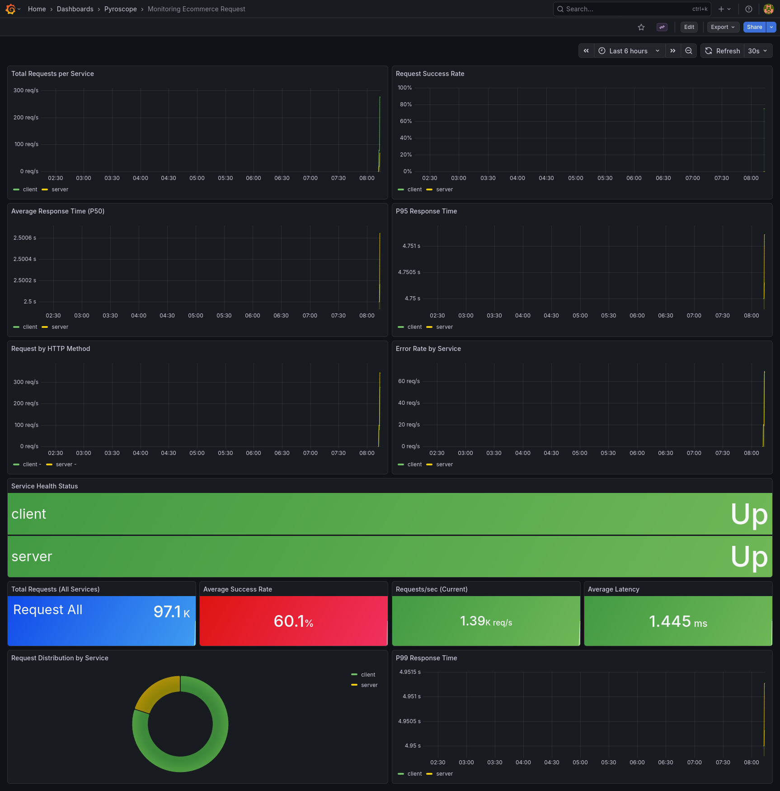
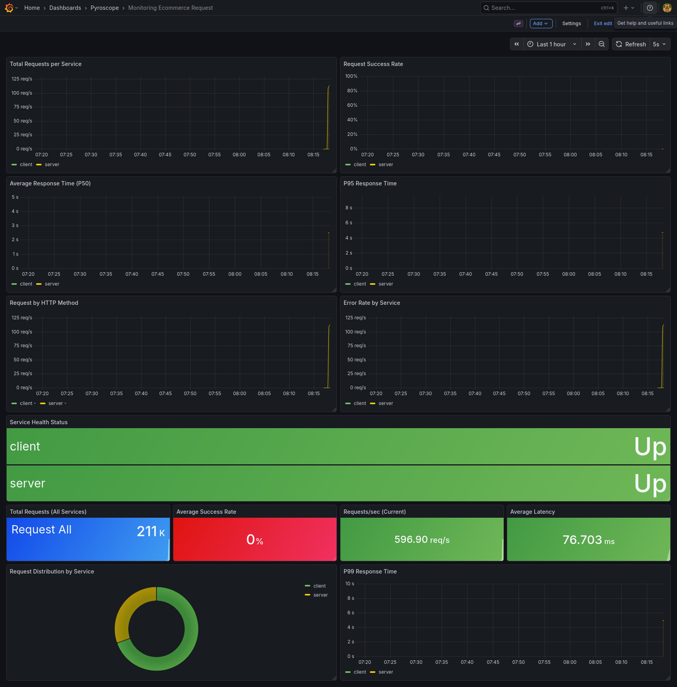
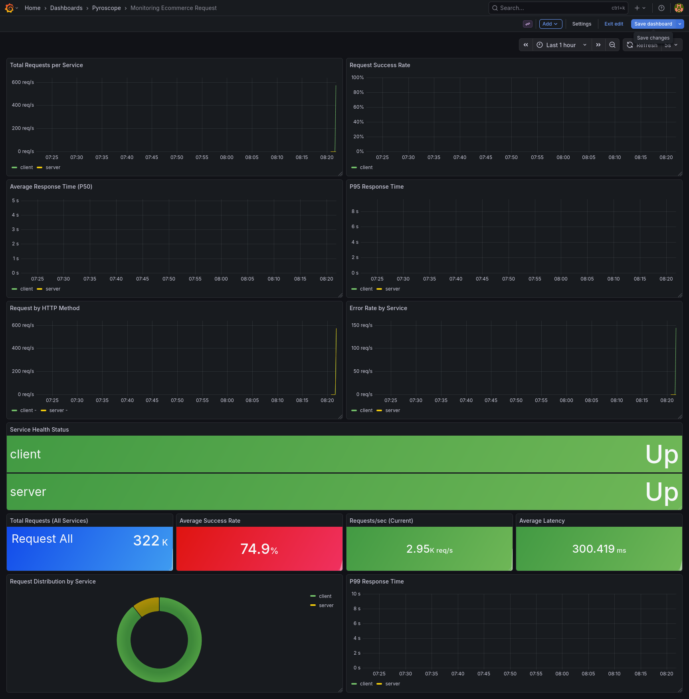
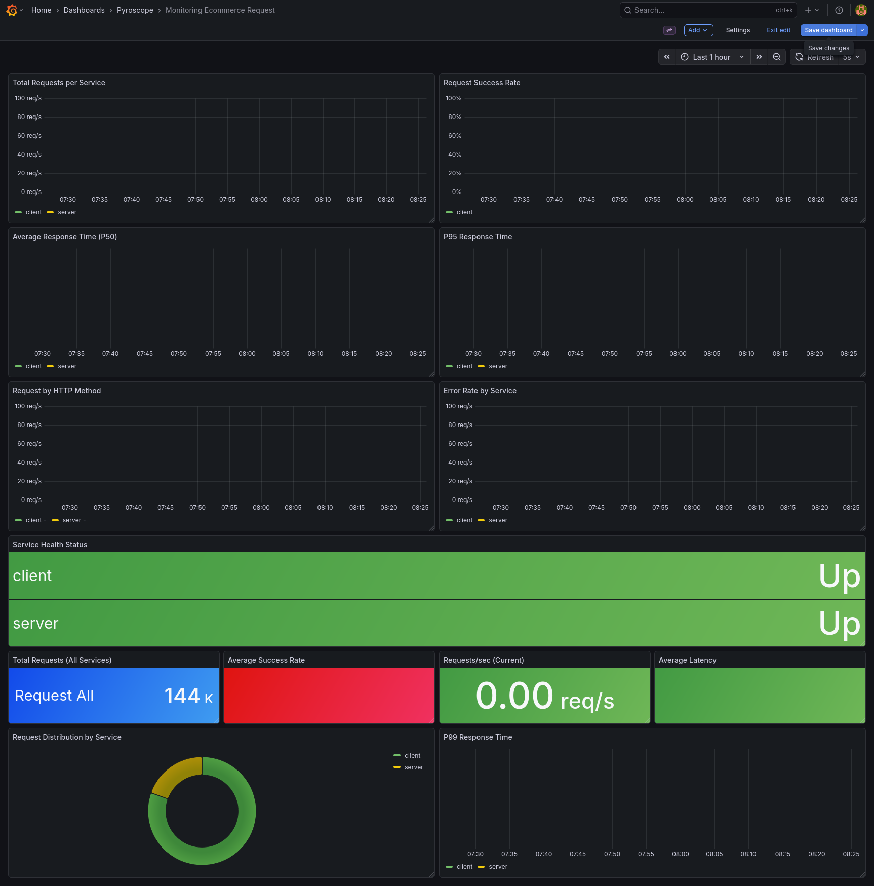
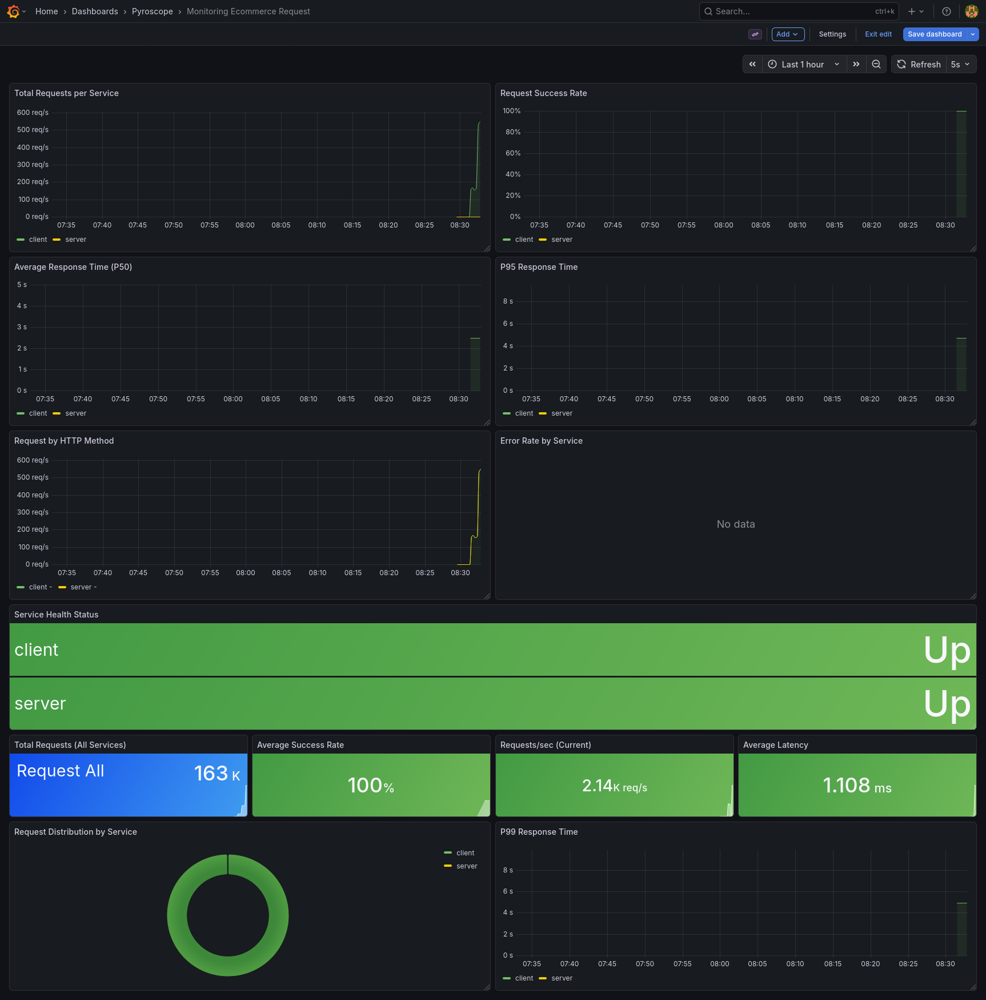
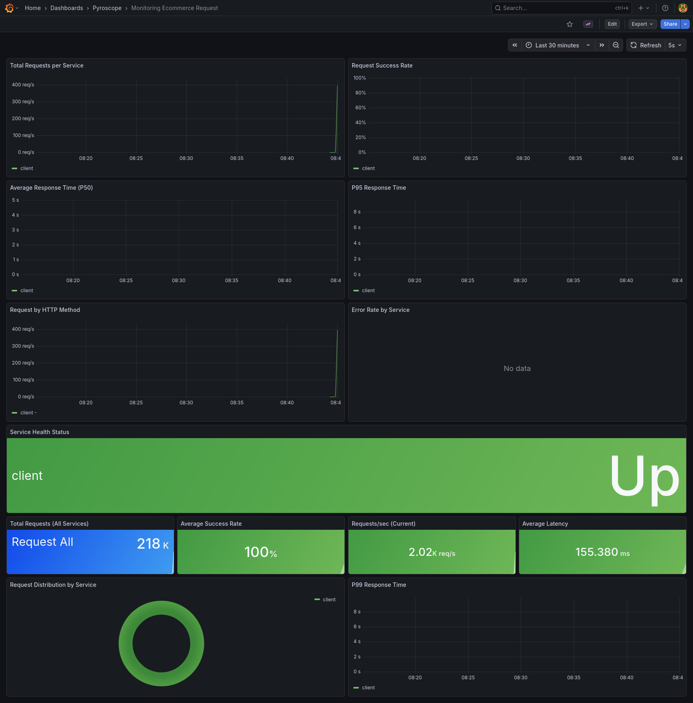
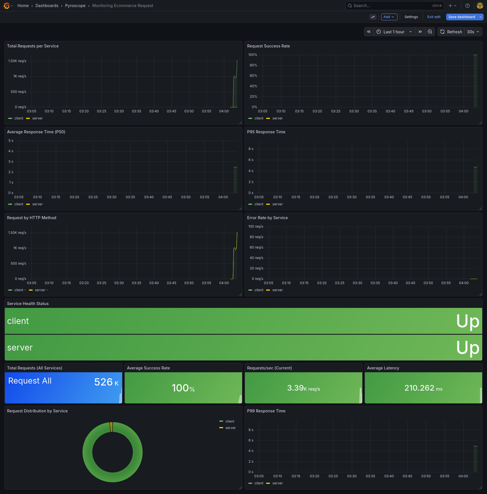
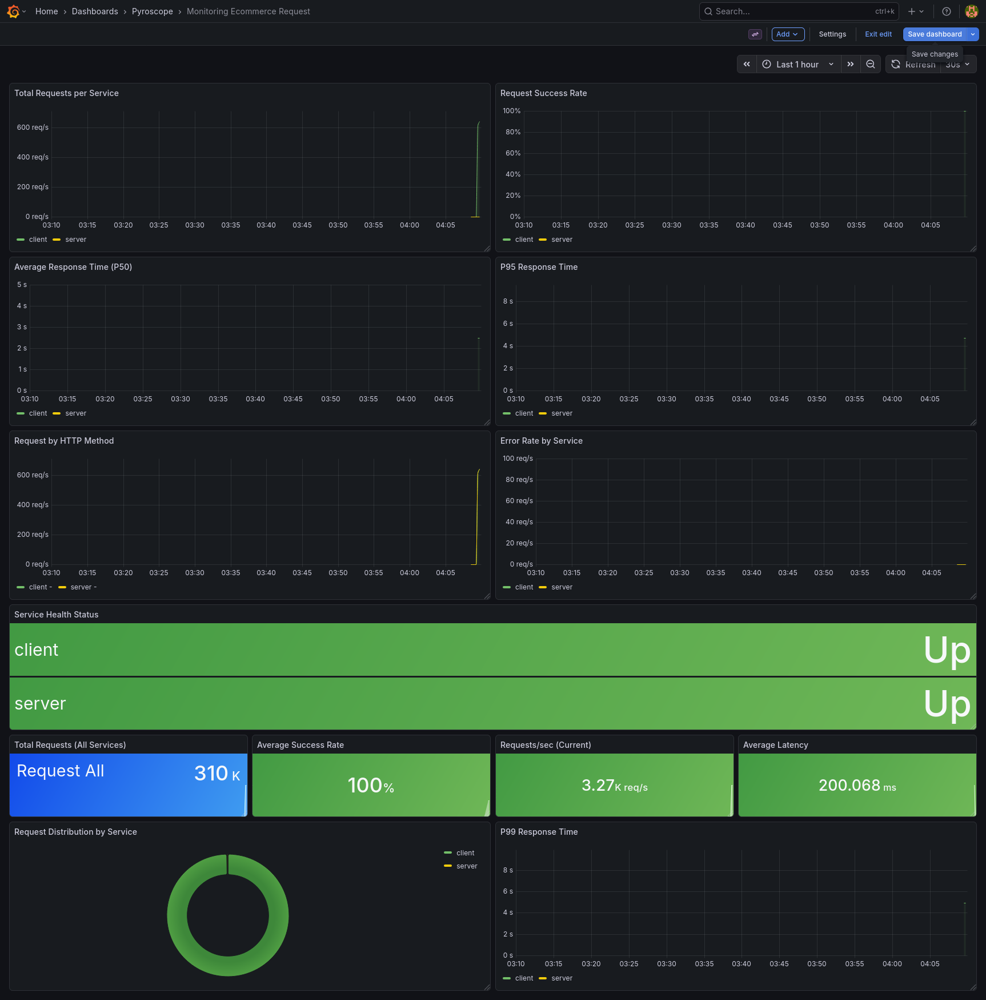
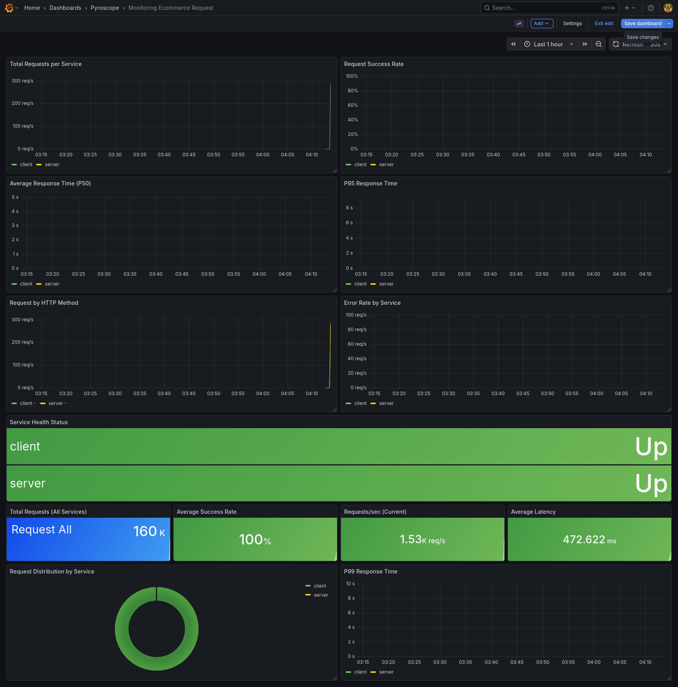

# E-Commerce gRPC Backend

This project is a backend implementation for an e-commerce platform designed to support all major business processes in digital commerce, from user management to payment transactions. The system is built with a modular approach, where each service has a specific responsibility but remains efficiently connected through inter-service communication.

The project architecture leverages **gRPC** as the communication protocol between services. With gRPC and Protobuf, data exchange between components is faster, lighter, and more extensible. This allows the system to be **scalable** as the number of users, products, and transactions grows significantly.

All critical data—from user details and product catalogs to transaction records—is stored consistently in a database, making this platform a **reliable, secure, and production-ready** foundation for modern e-commerce applications.

---

## 🎯 Core Features

- **🔐 Authentication & User Management**
  Supports registration, login, and **JWT-based** authorization. The system also allows for user role management (e.g., customer, merchant, or admin).

- **📦 Product & Category Management**
  Admins and merchants can add, modify, or delete products. Products are categorized to simplify search and stock management.

- **🏬 Merchant Management**
  Merchants can create accounts, manage their stores, and add their product catalogs.

- **🛒 Shopping Cart**
  Users can add products to their cart, update quantities, and save items before placing an order.

- **📑 Order Processing**
  Supports the full workflow from checkout to order recording. Each order is logged with product details, quantity, price, status, and shipping information.

- **💳 Transactions & Payments**
  The system records payments made by users for their orders. This process is designed to be **integrated with merchants** and recorded transparently.

- **⭐ Product Reviews**
  After an order is completed, users can leave reviews and ratings for the products they purchased, making the platform more interactive and building consumer trust.

---

## 🧰 Tech Stack


- 🐹 **Go (Golang)** — Implementation language.
- 🌐 **Echo** — Minimalist web framework for building REST APIs.
- 🪵 **Zap Logger** — Structured, high-performance logging for applications.
- 📦 **SQLC** — Generates type-safe Go code from SQL queries.
- 🚀 **gRPC** — High-performance RPC for internal service communication.
- 🧳 **Goose** — Migration tool for managing database schema changes.
- 🐳 **Docker** — Containerization platform for consistent development environments.
- 📄 **Swaggo** — Generates Swagger 2.0 documentation for Echo routes.
- 🔗 **Docker Compose** — Manages multi-container Docker applications.

---

## 🏛️ Architecture

### Entity-Relationship Diagram (ERD)

The following ERD illustrates the database schema for this project.


## 🚀 Getting Started

To get started with this project, follow these steps:

### 1. Clone the Repository

```bash
git clone https://github.com/MamangRust/ecommerce-grpc.git
cd ecommerce-grpc
```

### 2. Prerequisites

- Go (version 1.20+)
- Docker & Docker Compose
- `make`
- `protoc`

### 3. Configuration

Copy the `.env.example` file to `.env` and adjust the environment variables if necessary. To run with Docker, use `docker.env`.

## ⚙️ How to Run

You can run this project using Docker (recommended) or locally with Go.

### 1. Running with Docker

The easiest way to get started is with Docker Compose. This command will build the images, run the database, apply migrations, and start the gRPC server and HTTP client.

```bash
# Run all services in the background
make docker-up

# Stop all services
make docker-down
```

Services that will be running:
- `postgres`: PostgreSQL database on port `5432`.
- `server`: gRPC server on port `50051`.
- `client`: HTTP client (Gateway) on port `5000`.

### 2. Running Locally

If you are not using Docker, you can run each part manually.

```bash
# 1. Apply database migrations
make migrate

# 2. Run the gRPC server
make run-server

# 3. (In another terminal) Run the HTTP client/gateway
make run-client
```

### Other `make` Commands

- `make generate-proto`: Regenerate Go code from `.proto` files.
- `make lint`: Run the linter on the code.
- `make test`: Run unit tests.
- `make sqlc-generate`: Regenerate code from SQL queries using `sqlc`.

---

## 📊 Performance & Scalability Summary (k6)

### User Module

| Test Type  | VUs  | Throughput (req/s) | Error Rate | p95 Latency | Notes                                   |
| ---------- | ---- | ------------------ | ---------- | ----------- | --------------------------------------- |
| Smoke      | 1    | –                  | 0%         | <10 ms      | Acceptable under low load               |
| Capability | 222  | ~599               | 25%        | 167 ms      | GET /user/41 consistently failing       |
| Load       | 1000 | ~2172              | 25%        | 667 ms      | Latency and error thresholds breached   |
| Stress     | 1500 | ~2490              | 25%        | 578 ms      | Errors consistent across endpoints      |
| Spike      | 1000 | ~2157              | 25%        | 387 ms      | Fast spike exposes same failure pattern |

### Role Module

| Test Type  | VUs  | Throughput (req/s) | Error Rate | p95 Latency | Notes                                  |
| ---------- | ---- | ------------------ | ---------- | ----------- | -------------------------------------- |
| Smoke      | 1    | –                  | 0%         | <5 ms       | Acceptable under low load              |
| Capability | 169  | ~600               | 0%         | 225 ms      | Stable even at max concurrent VUs      |
| Load       | 1000 | ~3879              | 0.18%      | 411 ms      | Minor latency spike, nearly error-free |
| Stress     | 1500 | ~4125              | 0%         | 408 ms      | Stable under prolonged high load       |
| Spike      | 1000 | ~3629              | 0%         | 307 ms      | Handles sudden spike smoothly          |

### Transaction Module

| Test Type  | VUs  | Throughput (req/s) | Error Rate | p95 Latency | Notes                                               |
| ---------- | ---- | ------------------ | ---------- | ----------- | --------------------------------------------------- |
| Smoke      | 1    | –                  | 0%         | <135 ms     | Acceptable under low load                           |
| Capability | 900  | ~2584              | 0%         | 417 ms      | Stable, no failures observed                        |
| Load       | 1000 | ~4254              | 0.65%      | 346 ms      | Small fraction of requests failing                  |
| Stress     | 1500 | ~2776              | 0.01%      | 1.14 s      | Stress exposes long-tail latency for some endpoints |
| Spike      | 1500 | ~1539              | 0.02%      | 1.46 s      | Spike test shows high iteration duration            |

---

## 📈 Performance Test Visualizations

### User Module

| Test Type       | Visualization                                                                                                    |
| --------------- | ---------------------------------------------------------------------------------------------------------------- |
| Capability Test |             |
| Load Test       |      |
| Stress Test     |  |
| Spike Test      |                       |

### Role Module

| Test Type       | Visualization                                                                                                    |
| --------------- | ---------------------------------------------------------------------------------------------------------------- |
| Capability Test |             |
| Load Test       |      |
| Stress Test     |  |
| Spike Test      |                       |

### Transaction Module

| Test Type       | Visualization                                                                                                                         |
| --------------- | ------------------------------------------------------------------------------------------------------------------------------------- |
| Capability Test |              |
| Load Test       |      |
| Stress Test     |  |
| Spike Test      |                       |