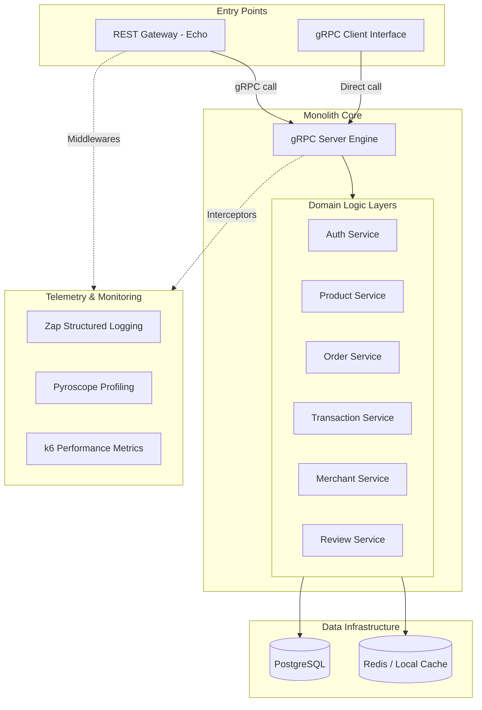
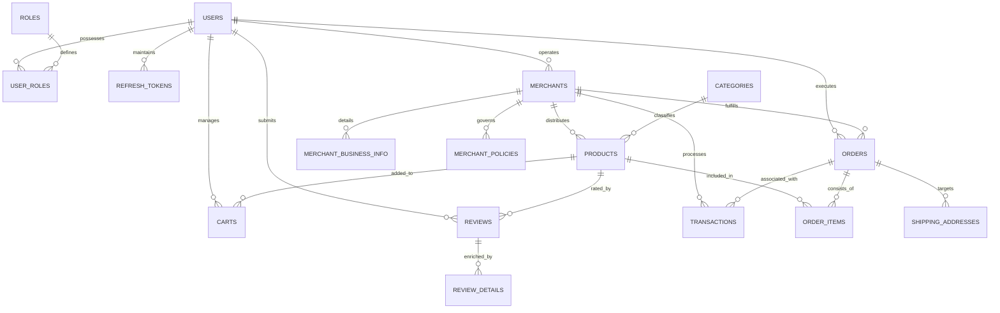

# E-Commerce gRPC  Monolith

A high-performance, scalable e-commerce backend implementation utilizing a  monolith architecture. This system is engineered to handle comprehensive digital commerce workflows—from user lifecycle management to complex transactional processing—leveraging gRPC for efficient inter-module communication and strong type safety.

## System Overview

The project is designed with a focus on high throughput and low-latency communication. By utilizing gRPC and Protocol Buffers, the system ensures optimized data serialization and robust service-to-service contracts. The architecture follows a  monolith pattern, enabling clear domain boundaries while maintaining a unified deployment model for operational simplicity.

### Architecture Topology

The following diagram illustrates the high-level system architecture and the flow of requests from external clients to the persistence layer.



## Core Domain Capabilities

- **Identity and Access Management**: Implementation of JWT-based authentication with secure token rotation and role-based access control (RBAC) supporting Customer, Merchant, and Administrator roles.
- **Product Lifecycle Management**: Comprehensive SKU management system with hierarchical categorization and merchant-specific catalog controls.
- **Merchant Ecosystem**: Multi-tenant merchant support including business verification, policy management, and social integration.
- **Transactional Consistency**: Robust order processing pipeline ensuring atomic transactions across order creation, inventory adjustments, and payment confirmation.
- **Observability and Profiling**: Integrated telemetry including structured logging and continuous profiling via Pyroscope interceptors for both REST and gRPC layers.

## Technical Specifications

| Component | Technology | Role |
| :--- | :--- | :--- |
| Runtime | Go (Golang) | core implementation language |
| Interface | Echo Framework | REST API gateway |
| Transport | gRPC | internal service communication |
| Database | PostgreSQL | relational data persistence |
| Data Access | SQLC | type-safe SQL query generation |
| Migrations | Goose | database schema version control |
| Logging | Uber Zap | structured high-performance logging |
| Profiling | Pyroscope | continuous performance profiling |
| Documentation | Swaggo | OpenAPI/Swagger documentation generation |

## Data Architecture

The persistence layer is modeled to ensure referential integrity and optimized query performance. The following ERD describes the core entity relationships within the schema.



## Operational Procedures

### Prerequisites

- Go Toolchain (v1.20+)
- Docker and Docker Compose
- Just / Make task runners
- Protoc compiler (for proto regeneration)

### Local Environment Setup

1. **Clone and initialize**:
   ```bash
   git clone https://github.com/MamangRust/ecommerce-grpc.git
   cd ecommerce-grpc
   ```

2. **Configuration**:
   Copy `.env.example` to `.env` and configure accordingly. For containerized execution, refer to `docker.env`.

3. **Containerized Execution (Recommended)**:
   ```bash
   just docker-up
   ```
   This initializes all infrastructure components, including PostgreSQL, the gRPC core server, and the REST gateway.

### Core Commands

| Command | Description |
| :--- | :--- |
| `just migrate` | Execute pending database migrations |
| `just generate-proto` | Compile Protocol Buffer definitions |
| `just sqlc-generate` | Generate Go code from SQL queries |
| `just test-all` | Run comprehensive test suite (Go + Hurl) |
| `just run-server` | Start the gRPC backend engine |
| `just run-client` | Start the REST API gateway |

## Performance Benchmarks

The system has been subjected to rigorous stress testing using k6 to identify throughput capacity and latency thresholds.

### User Domain Service

| Metric | Smoke | Load (1k VUs) | Stress (1.5k VUs) | Spike |
| :--- | :--- | :--- | :--- | :--- |
| Throughput | Baseline | 2172 req/s | 2490 req/s | 2157 req/s |
| Error Rate | 0.0% | 25.0% | 25.0% | 25.0% |
| p95 Latency | <10ms | 667ms | 578ms | 387ms |

### Transaction Domain Service

| Metric | Smoke | Capability (900 VUs) | Load (1k VUs) | Stress (1.5k VUs) |
| :--- | :--- | :--- | :--- | :--- |
| Throughput | Baseline | 2584 req/s | 4254 req/s | 2776 req/s |
| Error Rate | 0.0% | 0.0% | 0.65% | 0.01% |
| p95 Latency | <135ms | 417ms | 346ms | 1.14s |

## Observability and Monitoring

The system implements a multi-layered observability strategy:

- **Structured Logging**: Unified logging via Uber's Zap, ensuring all requests are traceable with unique context IDs.
- **Continuous Profiling**: Pyroscope interceptors are integrated into the gRPC unary chain and REST middleware to monitor CPU and Memory consumption in real-time.
- **Request Interceptors**: Automated telemetry for gRPC methods, including latency tracking and error rate monitoring.

## Performance & Simulation Visualizations

Detailed trajectory analysis of system behavior under various load profiles: Smoke, Capability, Load, Stress, and Spike tests.

### User Domain

| Profile | Behavior Metrics |
| :--- | :--- |
| **Capability** |  |
| **Load** |  |
| **Stress** |  |
| **Spike** |  |

### Role Domain

| Profile | Behavior Metrics |
| :--- | :--- |
| **Capability** |  |
| **Load** |  |
| **Stress** |  |
| **Spike** |  |

### Transaction Domain

| Profile | Behavior Metrics |
| :--- | :--- |
| **Capability** |  |
| **Load** |  |
| **Stress** |  |
| **Spike** |  |

